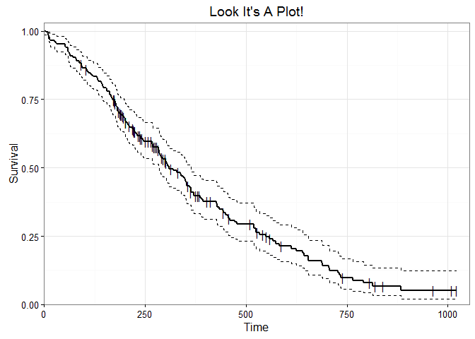
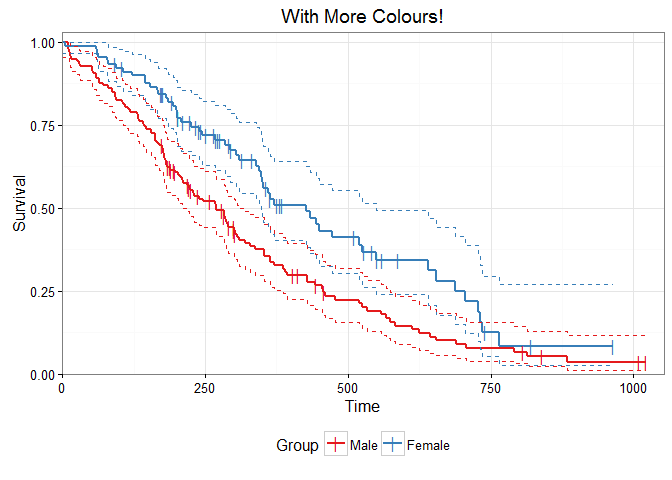
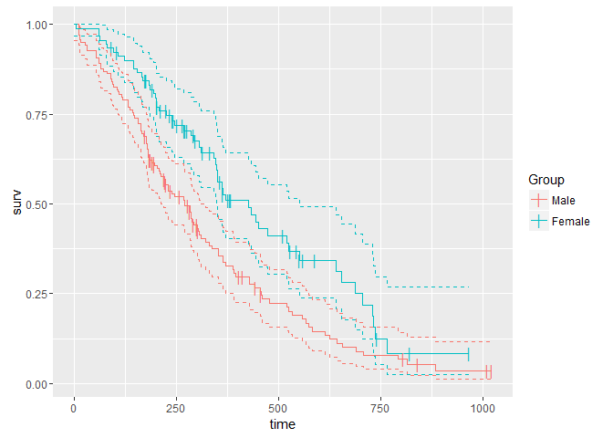
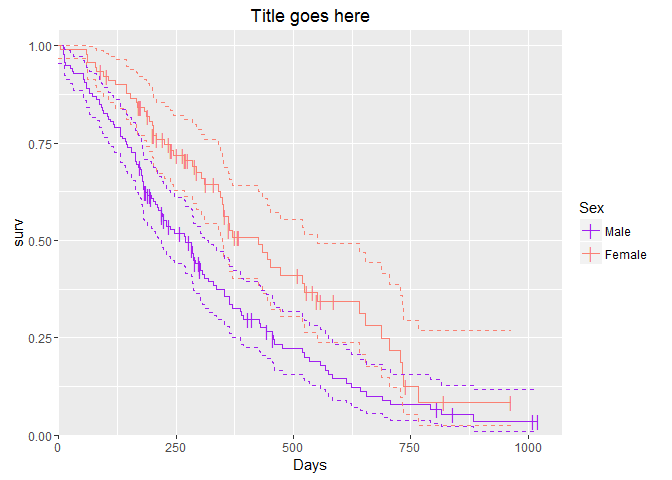
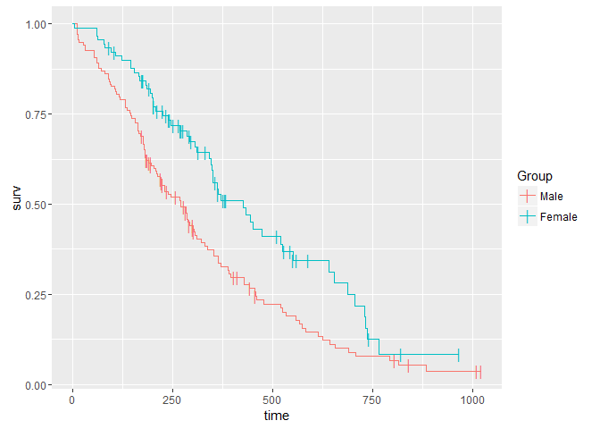
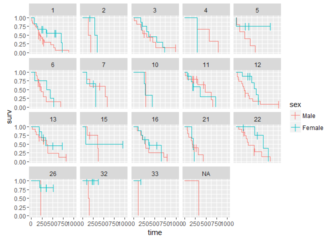

# README
Randall  
October 21, 2016  

# Introduction

`ggSurvival` is an R package designed to work within the ggplot framework. It provides both quick easy plotting functions for Kaplan-Meier survival plots as well as a survival dataframe generating function for users fluent in ggplot who wish to customize their plots.

If you are comfortbale with ggplot already then you may wish to jump to [Fluent ggplot Users](#fluent).

# Quick Start

This section is for people with a introductory understanding of R who just want to make a pretty Kaplan-Meier now.

## Install ggSurvival

`ggSurvival` can be installed directly from github:


```r
library(devtools)
install_github("hennerw/ggSurvival")
```

## Load packages


```r
library(ggSurvival)

# Required packages for ggSurvival
library(ggplot2)
library(survival)
library(dplyr)

# Additional packages used in this document.
library(tidyr)
```

If any of the packages other than ggSurvival are not already installed you can install them from CRAN using  `install.packages()`, or if you are using RStudio Tools > Install Packages.

## Data Set

As an example, I will be using the `cancer` data set from the `survival` package. This dataset is the overall survival of 228 lung cancer patients. See `?cancer` for more details. 

Please do not take anything I do with this set to be suggestions for an appropriate analysis on these data. I am simply using this dataset as an example.


```r
Data <- cancer %>%
  mutate(sex = factor(sex,levels=c(1,2),labels=c('Male','Female')),
         status = status -1 
         )  %>% 
  select(Instatution = inst,time, status,sex)

head(Data)
```

```
##   Instatution time status  sex
## 1           3  306      1 Male
## 2           3  455      1 Male
## 3           3 1010      0 Male
## 4           5  210      1 Male
## 5           1  883      1 Male
## 6          12 1022      0 Male
```

Note the change I made to `status`, this dataset codes event status as `1 = censored` and `2 = dead`, R's survival function assumes that `0 = censored` and `1 = event`, so in this case I can just subtract 1 to get the correct values. Be very careful, coding for events is not uniform and people will sometimes use `0 = death` and `1 = censored` which, without correction, will make your analysis meaningless.

Next up, we combine the `time` and `status` vectors into a R survival object.


```r
Data$Surv = Surv(Data$time,Data$status)
```

## Plotting

Now we are ready to generate the plot.


```r
ggPrettySurv(srv = Data$Surv,Main = "Look It's A Plot!")
```

<!-- -->

Or making a plot spit up by patient Gender:


```r
ggPrettySurv(srv = Data$Surv,Factor = Data$sex, Main = 'With More Colours!')
```

<!-- -->

## ggplot Themes

For people who are comfortable with ggplot and want to customize their plot, useing `ggSimpleSurv()` will produce a minimal ggplot that can be moddified with standard ggplot functions such as theme. (Though not facet wrapping, see the power user section)


```r
ggSimpleSurv(srv = Data$Surv,Factor = Data$sex)
```

<!-- -->

Compared to: 


```r
ggSimpleSurv(srv = Data$Surv,Factor = Data$sex) +
  ggtitle("Title goes here") +
  xlab('Days') +
  scale_y_continuous(limits=c(0,1.04),expand=c(0,0)) +
  scale_x_continuous(limits = c(0,max(Data$time) * 1.05),expand=c(0,0))+
  scale_color_manual(values = c('purple','salmon'),name='Sex')
```

<!-- -->

# <a name='fluent'></a>Fluent ggplot Users

The fucntion `survForm()` offers a convenient and flexible method of extracting the step function from a `Surv` object.

Using the dataset from quick start above:


```r
Step.Data <- survForm(Data$Surv,Data$sex)

head(Step.Data)
```

```
##   Group time n.risk n.event n.censor      surv     lower     upper
## 1  Male    0    138       0        0 1.0000000 0.9542301 1.0000000
## 2  Male   11    138       3        0 0.9782609 0.9542301 1.0000000
## 3  Male   12    135       1        0 0.9710145 0.9434235 0.9994124
## 4  Male   13    134       2        0 0.9565217 0.9230952 0.9911586
## 5  Male   15    132       1        0 0.9492754 0.9133612 0.9866017
## 6  Male   26    131       1        0 0.9420290 0.9038355 0.9818365
```

This returns a dataframe with a row for each occurrance 

which can then be fed into ggplot:

<!-- -->

## faccetting

Facceting is one of the most powerful and useful features of ggplot, it is a little tricky to use with survival data because of the processing that needs to be done outside. The `survForm` function works splits along one factor, but what if we have two?

For example, what if we wanted to plot each instatution seperatly? 

Using dplyr we can generate our step function table split on multiple factors. In this case, Instatution and Sex.


```r
Step.Data <- Data %>%
  group_by(Instatution,sex) %>%
  do(survForm(.$Surv))

head(Step.Data)
```

```
## Source: local data frame [6 x 9]
## Groups: Instatution, sex [1]
## 
##   Instatution    sex  time n.risk n.event n.censor      surv     lower
##         <dbl> <fctr> <dbl>  <dbl>   <dbl>    <dbl>     <dbl>     <dbl>
## 1           1   Male     0     24       0        0 1.0000000 0.8816314
## 2           1   Male    11     24       1        0 0.9583333 0.8816314
## 3           1   Male    12     23       1        0 0.9166667 0.8125004
## 4           1   Male    13     22       1        0 0.8750000 0.7522054
## 5           1   Male    26     21       1        0 0.8333333 0.6968111
## 6           1   Male    65     20       1        0 0.7916667 0.6447778
## # ... with 1 more variables: upper <dbl>
```

Now we can plot it using ggplot like normal:


```r
ggplot(Step.Data,aes(x=time,y=surv,color=sex))+
  geom_step()+
  geom_point(data=filter(Step.Data,n.censor >0),pch='|',size=4)+
  facet_wrap(~Instatution)
```

<!-- -->
